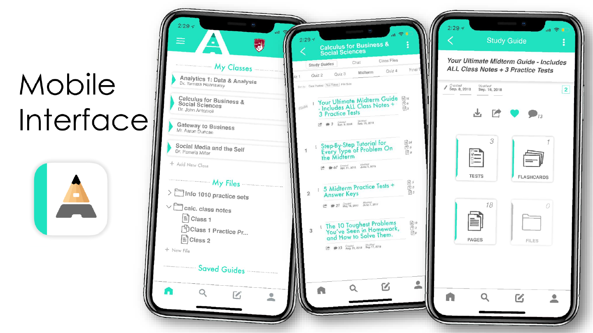
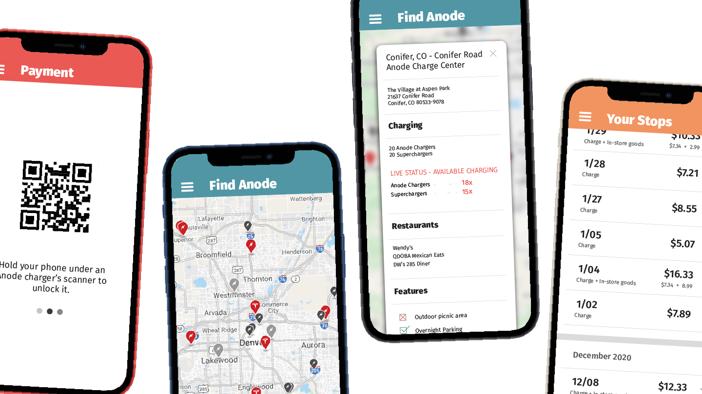

 

# Graphic Design

## Choose one..

<table>
  <tr>
    <th><b>YouTube Infographic</b></th>
    <th><b>Alphanote</b></th>
  </tr>
  <tr>
    <td></td>
    <td></td>
  </tr>
  <tr>
    <th><b>Anode</b></th>
    <th><b>Efficiency Revision</b></th>
  </tr>
  <tr>
    <td></td>
    <td></td>
  </tr>
</table>
