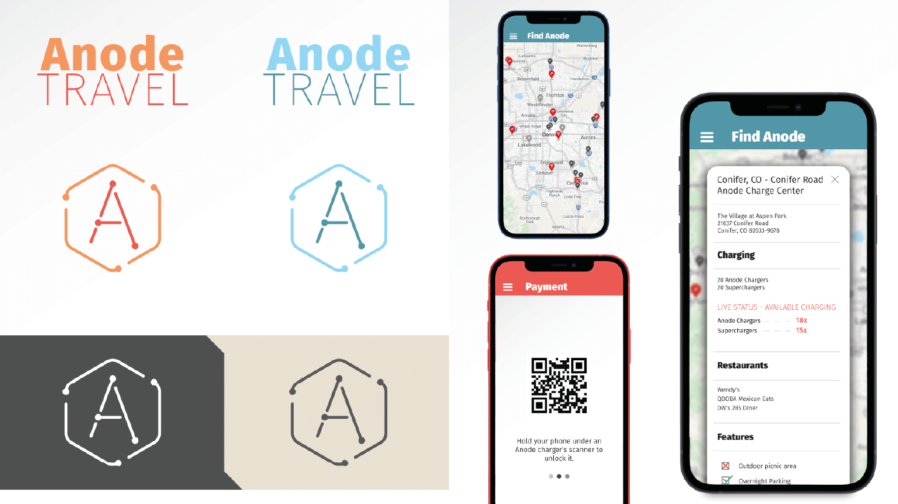

<a name="top"></a>

# Here is some of my work


<!-- [](#graphicdesign) -->
<!-- [](#database) -->
<!-- [](#java) -->
<!-- [](#python) -->
<!-- [](#vb) -->
<!-- []( s#vim) -->
<!-- [](#markdown) -->
<!-- [](#bottom) -->
<br>

<!-- VB.NET APPLICATION SCREENSHOT -->
<!-- https://user-images.githubusercontent.com/90723578/136726037-5e793725-719e-4475-a341-eea0211097c1.png -->


# Geo-Visualization App

### <a href="https://github.com/ryayoung/coloradoplot"> &nbsp; Code</a> &nbsp;&nbsp;&nbsp;&nbsp;&nbsp;&nbsp;&nbsp;&nbsp;&nbsp;&nbsp;&nbsp;&nbsp;<a href="https://colorado-crime.herokuapp.com/"> &nbsp; Website</a>

> A Python web app for visualizing Colorado geographic data. Nearly 400 variables to choose from, including crime stats, census data, student demographics, viewable by county or by district.

<details>
<summary><b>Tech</b></summary>

- **Web Framework:** Plotly Dash for Python
- **Logic and data structures:** Geopandas dataframes, and pure Python
- **Geocoding:** Google API
- **UI Components:** Mostly Dash Bootstrap components with some Dash Core components, and a lot of custom styling.

</details>


<br>

---

<br>

# chart-tools &nbsp;&nbsp;&nbsp;&nbsp;&nbsp;<a href="https://pypi.org/project/chart-tools/"></a>

### <a href="https://github.com/ryayoung/chart-tools"> &nbsp; Docs</a> &nbsp;&nbsp;&nbsp;&nbsp;&nbsp;&nbsp;&nbsp;&nbsp;&nbsp;&nbsp;&nbsp;&nbsp;<a href="https://pypi.org/project/chart-tools/"> &nbsp; PyPI</a>

> Python library with powerful pre-configured visualizations, useful functions to help you build charts faster, and an api for exploring, managing, loading, and generating documentation for online tabular datasets.

#### Example: the `superheat()` function
> A much better correlation matrix/heatmap. Marks are sized based on the strength of the correlation, and it offers advanced options such as masking marks below a threshold, excluding variables that correlate on average below a threshold, and, by default, masking duplicate correlations and self-on-self correlations.
```py
# Make an 18x18 inch chart with pre-defined styling, circular marks, grid hidden,
# hiding correlations below 0.1, hiding self-on-self correlations (default),
# and hiding repeated/duplicate correlations from the right side (default)
ct.set_style(18)
ct.superheat(df.corr(), thresh_mask=0.10, grid=False, marker='o');
```


<br>

---

<br>

## Power BI Dashboard
Here's a report I made for a sample database & [data simulation project](#python)
<br>(Unmute for narration)<br>

https://user-images.githubusercontent.com/90723578/161363277-efcb2183-78a2-4f59-9d22-1fd34b3818da.mov

<br>

---

## .NET Forms Application

This is a VB.NET application I made that communicates with an OLTP database.
<br>***This video is just a UI demonstration.*** For a walkthrough of the project, see the [SQL Database](#database) section.
<br>(Unmute for narration)<br>

https://user-images.githubusercontent.com/90723578/136682515-562cd1b8-dd9e-44ce-88bb-776dd553bf5a.mp4

---

<a name="graphicdesign"></a>
<br><br>
# Graphic Design 
[](GraphicDesign/README.md/#top)
<hr>

## Select one...

<table>
  <tr>
    <th><b>Infographic</b></th>
    <th><b>App Prototype</b></th>
  </tr>
  <tr>
    <td><a href="GraphicDesign/Infographic.md/#top"></a></td>
    <td><a href="GraphicDesign/MobileApp.md/#top"></a></td>
  </tr>
  <tr>
    <th><b>Brand Guide</b></th>
    <th><b>Logo Design</b></th>
  </tr>
  <tr>
    <td><a href="GraphicDesign/BrandGuide.md/#top"></a></td>
    <td><a href="GraphicDesign/LogoDesign.md/#top"></a></td>
  </tr>
</table>


<hr>

<a name="database"></a>
<br><br>
# SQL Database Work 
[](Database)
<hr>

## Karve Ski Demos

Karve is an online ski demo subscription for enthusiasts who always want the ideal gear for current snow conditions. Members have access to hundreds of skis at the touch of a button, delivered to their doorstep, with the freedom to swap products at any time with no additional cost.

To see how I populated this database with thousands of rows of realistic data by simulating normal and skewed distributions for customer measures based on gender, adding seasonality for consumer behavior, simulating ski damage patterns, and much more, see [Python Projects](#python).

Here is the diagram for Karve's OLTP database.


#### For an in-depth walkthrough of this project, [see more SQL/Database work](Database)


<hr>

<a name="java"></a>
<br><br>
# Java Projects 
[](JavaProjects)
<hr>

## Maze
This program randomly generates a unique maze, then solves it. Designed to run slowly in order to visualize what's going on, the pathfinder can recognize short dead-ends and avoid them. When the maze is complete, the path corrects itself, removing all dead-ends and revealing the shortest possible path to the finish line.

https://user-images.githubusercontent.com/90723578/136681997-f5c74bb6-6f57-4d3c-84cc-de1064729ad6.mp4


<hr>

<a name="python"></a>
<br><br>
# Python Projects 
[](PythonProjects)
<hr>

## Generating Highly Realistic Data to Populate a Database
Nearly all of the data in the [Karve OLTP database](#database) above was generated using a series of lengthy Python scripts, but *very few* attributes are truly randomized.
#### The program must do the following:

1. Simulate real business patters
    * Create an order volume distribution that's bimodal, peaking in Dec. and Mar. Then, _based on time of season_, choose how the length of time customers keep skis for will be distributed. This is skewed right for most of the season, but shortens in the spring since all rentals _must_ be returned by July 7th.   
   * Choose how often skis get damaged, which types of damage are most common, how often multiple (2-3) damages occur in one rental event, how often a ski gets totaled/broken, and which types of critical damage are most common. And, when a ski does get totaled, update records to permanently prevent it from being rented again.

2. Simulate a realistic distribution for each measure and include dependencies
    * Pick what percent of customers are male/female.
    * Height will be normally distributed based on gender.
    * Weight will be based on height, and also normally distributed differently based on gender.
    * Boot size will be normally distributed based on gender.
    * Boot sole length will be based on boot size and then randomized within 3 millimeters.
    * Skier ability level will be slightly skewed towards advanced skiers
    * Days Used (# of days a customer _claims_ to have actually used the ski) will roughly correlate with the # of days between order and return date.

#### Here are a few histograms of the simulated data:

<table>
  <tr>
    <td></td>
    <td></td>
  </tr>
</table>


<hr>

<a name="vim"></a>
<br><br>
# Vim Configuration & Plugins
[](Vim)
<hr>

### Plugins
<hr>

### [vim-annotate-me](https://github.com/ryayoung/vim-annotate-me)
1. Lets you **toggle** comment/uncomment one or multiple lines of code at a time with a single keypress.
2. Recognizes your filetype and will comment/uncomment according to that syntax. Especially useful in languages such as HTML, where commented code must be fully enclosed, AND the syntax is annoying to type by hand. (Ex: ```<!-- some html stuff -->```).
3. Automatically creates headers (name & today's date) at the top of any new document you create, or any empty document that you open, and comments out that header using correct syntax based on your filetype.
4. Lets you toggle the current file's header on/off with a single keypress, without disrupting your code, and without moving your cursor from its relative position.
5. As soon as you write/save a file that HAS been modified, the header (if one exists) will be updated with the current date.
6. The header format is fully customizeable, including the format of the current date. If you change the date format in your vimrc, the old dates in your previous files will automatically update with the new format once you save/write to them again.

### Execute Python INSIDE Vim
- A much nicer alternative to using your terminal
- _How it works_
  - When you press your key binding, it searches your current and parent directories for a python virtual environment. If none are found, then your machine's global python kernel will be used.
  - Current script gets executed silently, and its output is placed into a new Vim buffer at the bottom of your window.
  - This new buffer will only be tall enough to fit the output of your script, and its height gets updated every time you execute.
<details>
  <summary><b><i>Click here</i> to see the code. Paste into your vimrc to use it!</b></summary>

```vim
fun! ExecutePythonNewBuffer()
    " SOURCE FOR MAKING REUSABLE WINDOW: https://github.com/fatih/vim-go/blob/master/autoload/go/ui.vim

    " save and reload current file
    silent exe "update | edit"
    
    " add the console output
    silent exe "cd %:p:h"

    " get file path of current file
    let s:current_buffer_file_path = expand("%")

    let s:output_buffer_name = ">>> Python Output for " . s:current_buffer_file_path
    let s:output_buffer_filetype = "output"

    " reuse existing buffer window if it exists otherwise create a new one
    if !exists("s:buf_nr") || !bufexists(s:buf_nr)
        silent exe 'botright new ' . s:output_buffer_name
        let s:buf_nr = bufnr('%')
    elseif bufwinnr(s:buf_nr) == -1
        silent exe 'botright new'
        silent exe s:buf_nr . 'buffer'
    elseif bufwinnr(s:buf_nr) != bufwinnr('%')
        silent exe bufwinnr(s:buf_nr) . 'wincmd w'
    endif

    " silent exe "setlocal filetype=" . s:output_buffer_filetype
    silent exe "setlocal filetype=typescript"
    setlocal bufhidden=delete "When buffer is closed, it is deleted
    setlocal buftype=nofile "Tells vim this buffer isn't related to a file and won't be written
    setlocal noswapfile "Prevents a swap file being created
    setlocal nobuflisted "Buffer won't show up in list of buffers
    setlocal winfixheight "Keeps window height the same as other buffers are opened/closed
    setlocal cursorline " make it easy to distinguish
    " setlocal nonumber
    setlocal norelativenumber "Line numbering is ordered, not relative
    setlocal wrap linebreak "Lines wrap so everything is visible. VERY IMPORTANT FOR ERROR OUTPUT
    setlocal showbreak="" "String to put at the start of lines that have been broken

    " clear the buffer
    setlocal noreadonly
    setlocal modifiable
    %delete _

    let l:env = "virtual"
    if filereadable("env/pyvenv.cfg") == 1
        silent exe ".!source env/bin/activate&&python3 " . shellescape(s:current_buffer_file_path, 2)

    elseif filereadable("../env/pyvenv.cfg") == 1
        silent exe ".!source ../env/bin/activate&&python3 " . shellescape(s:current_buffer_file_path, 2)

    elseif filereadable("../../env/pyvenv.cfg") == 1
        silent exe ".!source ../../env/bin/activate&&python3 " . shellescape(s:current_buffer_file_path, 2)

    elseif filereadable("../../../env/pyvenv.cfg") == 1
        silent exe ".!source ../../../env/bin/activate&&python3 " . shellescape(s:current_buffer_file_path, 2)

    else
        silent exe ".!python3 " . shellescape(s:current_buffer_file_path, 2)
        let l:env = "global"
    endif

    exe 'normal! ggO'
    " call setline(".", "'----- PYTHON OUTPUT FOR " . s:current_buffer_file_path . " -----'")

    " resize window to content length
    if line('$') < 30
        silent exe 'resize' . (line('$') + 3)
    else
        silent exe 'resize 33' 
    endif

    " make the buffer non modifiable
    setlocal readonly
    setlocal nomodifiable

    " Move cursor back to original buffer
    silent exe "call feedkeys('\<c-w>\<c-p>')"

    echo "Executed in " . l:env . " environment"
    " echo "SUCCESSFUL"

endfun

```
</details>


### Quick Marks: Quickly create and auto-toggle global garks
Marks, while extremely useful, are a bit cumbersome to use. Do you ever forget which marks map to which places, accidentally try to use a local mark globally, create too many marks and lose track of them, or find that the syntax is too cumbersome for quickly switching between two marks?

This script streamlines the most common use case for marks, making your workflow more efficient:
```vim
nnoremap mm mM:echo "GLOBAL MARK 1 SET"<CR>
nnoremap mM mK:echo "GLOBAL MARK 2 SET"<CR>
nnoremap <Leader>m 'M:call ToggleSmartMarkA()<CR>
let g:smart_mark_global = 1
function! ToggleSmartMarkA()
  if g:smart_mark_global > 0
    nnoremap <Leader>m 'K:call ToggleSmartMarkA()<CR>
    echo "GLOBAL MARK 1"
  else
    nnoremap <Leader>m 'M:call ToggleSmartMarkA()<CR>
    echo "GLOBAL MARK 2"
  endif
  let g:smart_mark_global = -g:smart_mark_global
endfunction
```
How do you use it? First, "mm" sets global mark 1, and "mM" sets global mark 2. This simplifies the process of creating global marks and makes it intuitive to remember which one is which. Now for the fun part. Once you've set the two marks, ```<Leader>m``` will **toggle** between them. If you have your spacebar set as your leader key, this is an extremely fast command to press. Better yet, this eliminates the need for you to remember which mark is which. You can simply move to the "other" one.


### Quickly nudge lines up and down
This is super fun to use. I call it "nudging". Make a selection in visual mode, and nudge it up or down 1 line using J or K.
```vim
vnoremap J :m '>+1<CR>gv=gv
vnoremap K :m '<-2<CR>gv=gv
```

<hr>

<a name="markdown"></a>
<br><br>
# Github Markdown - Interactive Tutorial
[](https://github.com/ryayoung/markdown-cheatsheet)
<hr>

Amazing documentation [like this](https://spacy.io/usage/linguistic-features/) is hard to come by. Github has some sweet features you can take advantage of in your readme pages with very little effort. For example, you can even fold text like this:

<details>
  <summary><i><b>CLICK ME!</b></i></summary>

- I am an inside of an html ```details``` element. See the tutorial above for how to use me!

```python
print("I'm colored with python syntax highlighting, AND I'm encased inside a text folding element :)")
```
</details>

<br><hr><br>

<a name="bottom"></a>
[](#top)
